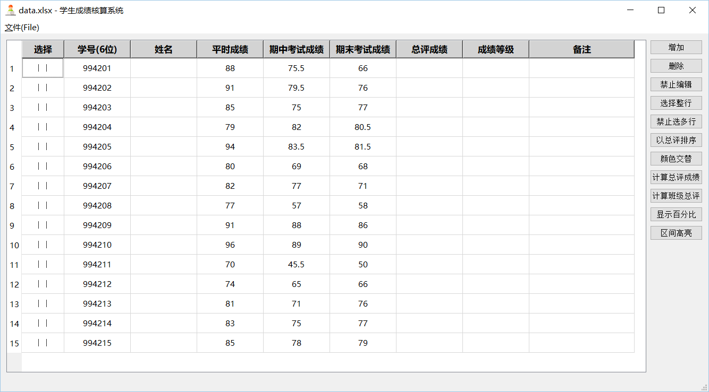
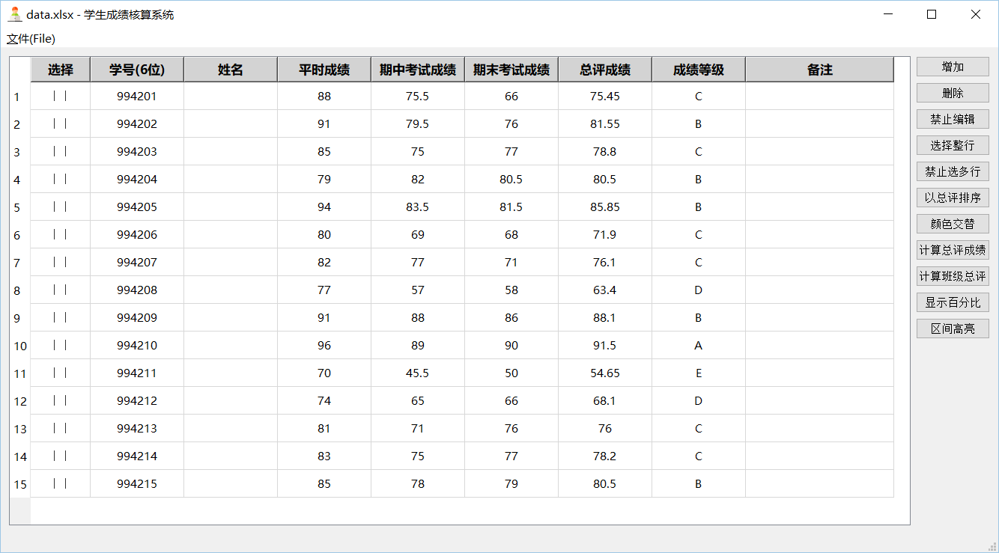
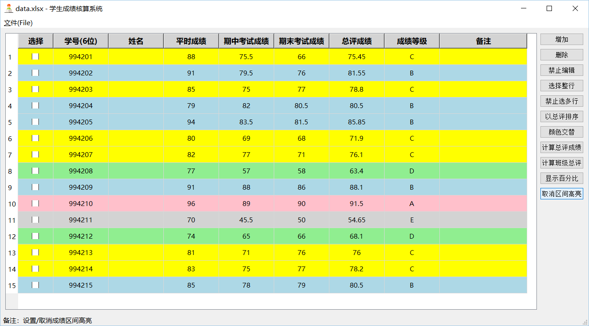
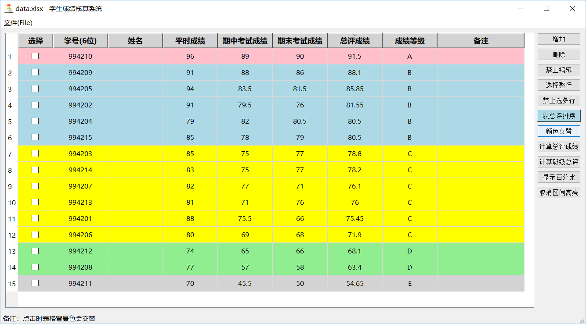
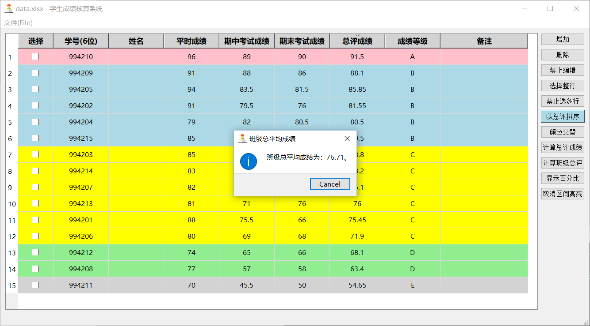
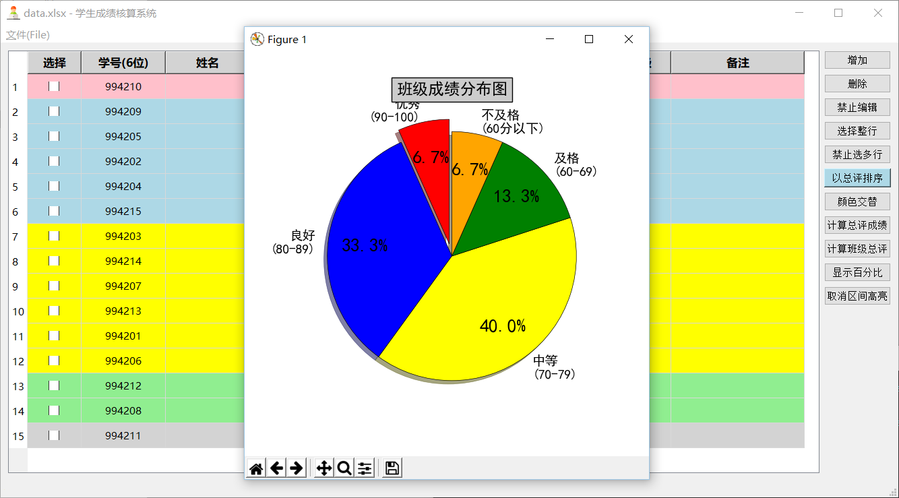

# B1-学生成绩核算系统
B1题。

## 题目描述
学生成绩核算系统的设计与实现（25）

要求：
* 按班级按课程从文件中读入相应的平时成绩、期中考试成绩和期末考试成绩。
* 三个成绩对总评成绩的百分比被定义为常数，各占总成绩的30%、30%和40%。
* 计算每位学生的总评成绩。
* 计算该班级本课程的总平均成绩。
* 计算处于优、良、中、及格、不及格的学生人数以及占总人数的百分比。其中100-90为优，89-80为良，79-70为中，69-60为及格，60分以下为不及格。
* 按要求输出成绩在优、良、中、及格、不及格各区间的学生学号、成绩。


## 如何使用
### 方法一、使用release版
在项目的[release](https://github.com/Pragmatism0220/AppDesign/releases)界面下载对应的最新的release版本，然后直接双击运行即可。

### 方法二、源码运行
首先利用git克隆该项目到本地：
```shell
git clone https://github.com/Pragmatism0220/AppDesign.git
```
克隆之后，所对应的每个文件夹都是一个项目；先进入该项目，之后在确保已经安装Python3的情况下，安装相应的依赖，使用命令：
```shell
pip install -r requirements.txt
```
如果你的默认Python版本不是3的话，你应该使用`pip3`代替`pip`。

然后使用命令：
```shell
python app.py
```
同样地，如果你的默认Python版本不是3的话，你应该使用`python3`代替`python`。













之后，尽情享受吧！

功能：
* **文件**：支持`打开`、`保存`、`另存为`、`打印`。输入数据文件支持`.xls`、`.xlsx`、`.xlsm`、`.csv`和`.ods`数据格式。
* **增加**：点击后会随机增加一行数据。数据来源由[Faker](https://github.com/joke2k/faker)开源库提供，非常感谢！
* **删除**：删除掉选中的行（复选框选择）。
* **禁止编辑**：表格默认是可以编辑、更改的。按下该按钮后表格将变为“只读”模式。
* **选择整行**：默认是点击单个单元格，则选择该单元格。该按钮使得选择的单位成为“按行选择”，按下后则整行均被选中。
* **禁止选多行**：默认允许同时选择多行。按下该按钮后则不能同时选择多行。
* **以分数排序**：点击后将按`分数`排序，升序或降序轮换。同时，点击表头也可以快速进行排序。
* **颜色交替**：使得单元格的背景色交替，更为美观。
* **计算总评成绩**：计算每个学生的总评成绩及对应的成绩等级。
* **计算班级总评**：以弹窗的形式计算出班级的总平均总评成绩。
* **显示百分比**：以扇形图的形式展示班级的百分比分布。`优秀`的部分会突出显示。
* **区间高亮**：按不同的等级进行区间的划分，以不同的颜色进行区间高亮显示。支持排序，支持高亮后取消。

## 一些细节
项目分为三个文件：`app.py`、`UI.py`和`images.py`。其中`images.py`里是图标的base64编码信息。

`app.py`是主控脚本，负责调用`UI.py`，本身不涉及任何实现；`UI.py`是前端和后端的集成，由类和类方法实现。对于更详细的踩坑过程，可以访问[我的博客](https://pragmatism0220.cf/)~~（随缘更新）~~。~~由于一些特殊的原因国内访问可能会比较慢。~~

哦对了，由于我将图标文件以字节的形式硬编码到了源代码中，因此源代码中的个别行可能会非常长。在Pycharm中进行开发时，Pycharm会强制进行换行：
```
This document contains very long lines. Soft wraps were forcibly enabled to improve editor performance.
```
~~对没错，这是个feature。~~

附上解决方法：

在Pycharm上方工具栏中点击`Help`，然后点击`Edit Custom Properties...`，打开（没有则创建）`idea.properties`文件，强行修改自动换行的阈值。在文件中键入：
```
editor.soft.wrap.force.limit=500000
```
也就是指定一个较大的数字。保存后，重启Pycharm即可。请注意，编辑器可能会因此变得很慢。默认限制值为10000。

## 已知问题
暂时未发现新的问题。欢迎提issue。

## 作者
一个学生，一个宅男。

* **联系方式**
  * 博客： https://pragmatism0220.cf/
  * 电子邮件: pragmatism0220@gmail.com
  * 微博: [@保護者_Pragmatism0220](https://weibo.com/u/7341561133)
  * 推特: [@Pragmatism_0220](https://twitter.com/Pragmatism_0220)

## 开源许可证
[Mozilla Public License 2.0](https://github.com/Pragmatism0220/AppDesign/blob/master/LICENSE)
