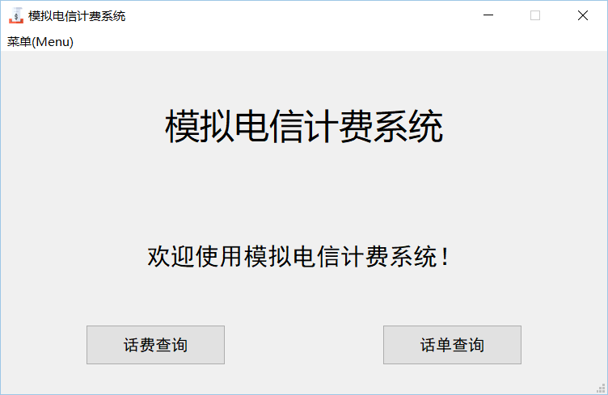
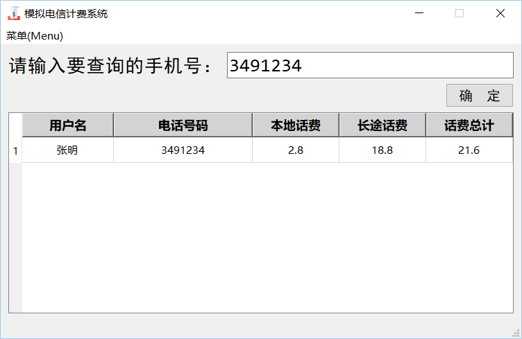
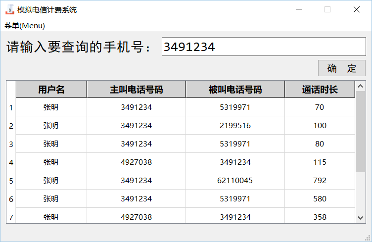

# B2-模拟电信计费系统
B2题。

## 题目描述
模拟电信计费系统的设计与实现（25）

要求：
* 计费功能。根据存放在源数据文件中的通话记录和长途费率文件对每一条通话记录计算其通话费用，并将结果保存在费用文件中。其中：
通话费的计算方法如下：
```
通话费 = 长途电话费 + 本地电话费
长途电话费 = 费率(元/分钟) × 通话时长(分钟)
(通话时长不满1分钟的按1分钟计算)

本地电话费为：3分钟以内0.5元，以后每3分钟递增0.2元。
```
* 话费查询。输入一个电话号码，从费用文件中统计该电话号码的所有本地话费、长途话费，并从用户文件中查找其用户名，最后在屏幕上显示：
```
用户名  电话号码  本地话费  长途话费  话费总计
```
* 话单查询。输入一个电话号码，查询并在屏幕显示该用户的所有通话记录，格式为：
```
用户名  主叫电话号码  被叫电话号码  通话时长
```

## 如何使用
### 方法一、使用release版
在项目的[release](https://github.com/Pragmatism0220/AppDesign/releases)界面下载对应的最新的release版本，然后直接双击运行即可。

### 方法二、源码运行
首先利用git克隆该项目到本地：
```shell
git clone https://github.com/Pragmatism0220/AppDesign.git
```
克隆之后，所对应的每个文件夹都是一个项目；先进入该项目，之后在确保已经安装Python3的情况下，安装相应的依赖，使用命令：
```shell
pip install -r requirements.txt
```
如果你的默认Python版本不是3的话，你应该使用`pip3`代替`pip`。

然后使用命令：
```shell
python app.py
```
同样地，如果你的默认Python版本不是3的话，你应该使用`python3`代替`python`。






之后，尽情享受吧！

功能：
* **话费查询**：点击后弹出`话费查询`应用程序界面。
* **话单查询**：点击后弹出`话单查询`应用程序界面。
* **菜单**：支持退出快捷键<kbd>Esc</kbd>。
* **输出费用文件**：以Excel文件进行保存。

## 一些细节
项目分为两个文件：`app.py`和`UI.py`。

`app.py`是主控脚本，负责调用`UI.py`，本身不涉及任何实现；`UI.py`是前端和后端的集成，由类和类方法实现。对于更详细的踩坑过程，可以访问[我的博客](https://pragmatism0220.cf/)~~（随缘更新）~~。~~由于一些特殊的原因国内访问可能会比较慢。~~

哦对了，由于我将图标文件以字节的形式硬编码到了源代码中，因此源代码中的个别行可能会非常长。在Pycharm中进行开发时，Pycharm会强制进行换行：
```
This document contains very long lines. Soft wraps were forcibly enabled to improve editor performance.
```
~~对没错，这是个feature。~~

附上解决方法：

在Pycharm上方工具栏中点击`Help`，然后点击`Edit Custom Properties...`，打开（没有则创建）`idea.properties`文件，强行修改自动换行的阈值。在文件中键入：
```
editor.soft.wrap.force.limit=500000
```
也就是指定一个较大的数字。保存后，重启Pycharm即可。请注意，编辑器可能会因此变得很慢。默认限制值为10000。

## 已知问题
暂时未发现新的问题。欢迎提issue。

## 作者
一个学生，一个宅男。

* **联系方式**
  * 博客： https://pragmatism0220.cf/
  * 电子邮件: pragmatism0220@gmail.com
  * 微博: [@保護者_Pragmatism0220](https://weibo.com/u/7341561133)
  * 推特: [@Pragmatism_0220](https://twitter.com/Pragmatism_0220)

## 开源许可证
[Mozilla Public License 2.0](https://github.com/Pragmatism0220/AppDesign/blob/master/LICENSE)
